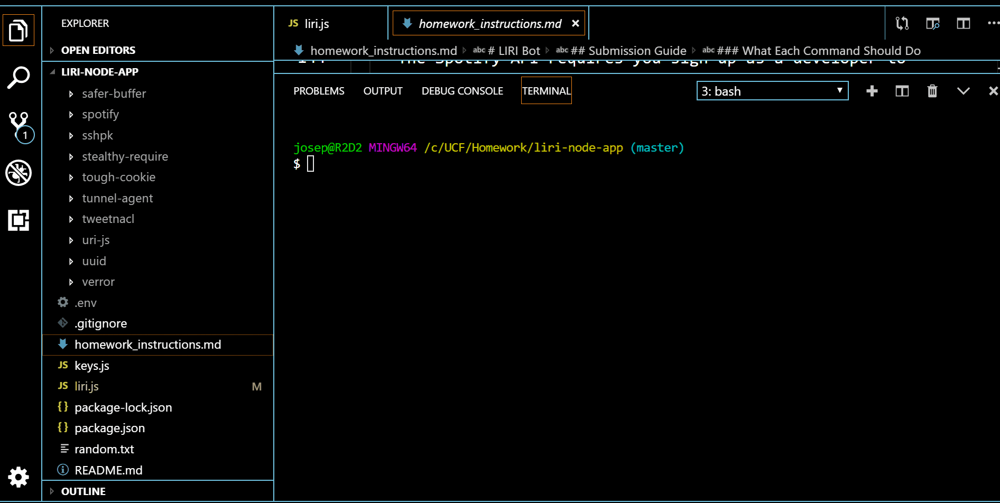

# Liri  
Welcome to Liri (Siri wannabe)
Liri is a Node.js Language assistant program that will help you find out information about songs, movies, and even where your favorite band is playing and when.  

### Prerequisites
To run Liri you will need to install the following npm packages
dotenv
moment
fs
axios
node-spotify-api
and the keys.js file
### Installing
The above can all be installed by typing 'npm install'

## Getting Started
Liri will run with the following commands:
movie-this <movie name >
spotify-this-song <song name>
concert-this <band name>

## Video of progam in use

*  - working gif

## Contributing
A node.js file by Joseph Falconettti
## Versioning
Ver 1.0.0

## License
FL Drivers  
